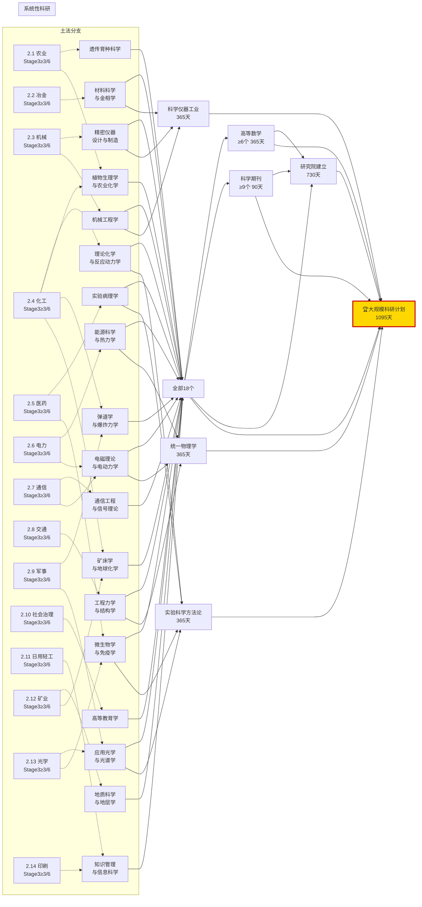

# 《群友群穿》科技树 DAG 指南

> ⚠️ **本指南已完成使命，已归档。AI 请勿再调用本文件。**
> 科技树内容已迁移至 `mvu_schema.ts`（初始值）、`initvar.yaml`（初始化变量）及 `tech_tree.ts`（硬编码节点清单）中，由 `MVU脚本施工指南.md` 统一管理。
> **后续修改科技树请直接修改上述源文件，不要参考本指南。**

> 本指南为 `MVU脚本施工指南.md` 中「模块三：科技树」的补充——独立维护完整的科技节点清单、DAG 依赖关系与平衡性参考。
> 修改科技树时优先改本文件，确认无误后同步到 `mvu_schema.ts` 的初始值与 `initvar.yaml`。

---

## 零、科技树写完后，AI 如何"认识到能力解锁"

> 这是科技树设计最容易遗漏的一环：**科技树本身（含每个节点的 `解锁能力` 字段）硬编码在 `tech_tree.ts`，不进 MVU、不进 AI 上下文**。若不做特殊处理，AI 每轮只能看到 `stat_data.科技树.科技节点` 里的数字（已研发天数/启动时间/完成时间），既不知道哪些能力已解锁，也会被未解锁能力干扰判断。

### 0.1 问题

| 盲点                         | 后果                                                      |
| ---------------------------- | --------------------------------------------------------- |
| AI 看不到 `解锁能力` 字段    | 节点完成后 AI 仍以为"不能炼钢"，叙事与状态脱节            |
| 若把所有节点解锁能力塞进 MVU | AI 会看到未解锁能力并误用（蒸汽机没研发就让角色用蒸汽机） |

### 0.2 解决方案：派生字段做三层信息分级

在 `transforms.ts` 的 `deriveAll` 中新增两个 `$` 前缀派生字段（AI 只读，自动派生）：

| 层级       | 派生字段            | 内容                                                               | AI 可见性                       |
| ---------- | ------------------- | ------------------------------------------------------------------ | ------------------------------- |
| 层1 已解锁 | `$已解锁能力清单`   | 已完成节点的解锁能力汇总，每条带 `[分支] 能力（节点名，完成时间）` | ✅ AI 叙事可用能力的**唯一来源** |
| 层2 可启动 | `$可启动的科技节点` | 前置科技已全部完成的未完成节点 + 其解锁能力预览                    | ✅ AI 据此选择研究方向           |
| 层3 不可见 | （无）              | 前置未满足的远期节点                                               | ❌ AI 完全看不到，零干扰         |

这样 AI 每轮看到的是「当前已解锁的能力清单」+「接下来可研发的候选节点及其能力预览」，既不遗漏已解锁能力，也不被远期未解锁能力干扰。

### 0.3 防误用兜底

兜底脚本规则 **11e** 会扫描 AI 输出文本，检测是否出现"未解锁但易误用"的能力关键词（如蒸汽机/电报/抗生素等）。若 AI 在叙事中把未解锁能力当作已实现能力使用（而非"规划/讨论/否定"语境），脚本会 `console.warn` 并在事件队列追加 GM 提示事件，进入下一轮上下文提示 AI 自我纠正。

### 0.4 状态栏与 AI 上下文的区别

- **状态栏 `TechTreePanel`**：展示完整 DAG（含所有节点、前置依赖、远期节点），供 USER/GM 决策。这是给玩家看的，不进 AI 上下文。
- **AI 上下文**：只进 `$已解锁能力清单` + `$可启动的科技节点` 两个派生字段，远期节点对 AI 不可见。

### 0.5 实现位置

- 派生函数实现：`MVU脚本施工指南.md` §2.4 `deriveAll` 中的 `derive已解锁能力清单` / `derive可启动的科技节点`
- AI 使用约束：`MVU脚本施工指南.md` §4.1 变量更新规则.yaml 的 `$已解锁能力清单` / `$可启动的科技节点` / `_AI能力使用总约束` 段落
- 误用检测：`MVU脚本施工指南.md` §3.1 兜底规则 11e

---

## 一、科技树总览

### 1.1 设计原则

| 原则                   | 说明                                                                                                                     |
| ---------------------- | ------------------------------------------------------------------------------------------------------------------------ |
| **终极目标**           | 穿越后约 **10-12 年**，政权获得独立发起大规模跨学科科研计划的能力（见 2.15 系统性科研分支）。达成后转入 COT 角色扮演核心 |
| **政权规模前置**       | 高阶科技（极难/史诗）隐式依赖政权规模——没有足够人口基数、领土面积和行政体系，无法支撑国家级科研工程                      |
| **前置依赖不可跳过**   | 所有前置科技必须完成后才能启动后续节点（兜底脚本规则 11a 硬约束）                                                        |
| **研发耗时按难度分级** | 简单=7-60天 / 中等=60-180天 / 复杂=180-365天 / 极难=365-730天 / 史诗=730-1460天                                          |
| **已完成节点即时可用** | `研发总耗时_天=1` 且 `已研发天数=1` = 穿越当天群友自带能力                                                               |
| **GM 可自由扩展**      | 新节点可随时 insert，只需满足前置依赖和设定合理的研发耗时                                                                |
| **科研导向设计**       | 所有分支最终汇聚于支持系统性科研能力。每分支三阶段共 ~20 节点，第三阶段 ≥50% 解锁即为土发终点                            |

### 1.2 研发速率系统

| 方向         | 初始数量 | 速率 | 说明                                                                     |
| ------------ | -------- | ---- | ------------------------------------------------------------------------ |
| 主要研究方向 | 1 个     | 100% | 全力攻关。**每完成一个整合型节点（M1-M6 + 大规模科研计划共 7 个）+1 槽** |
| 次要研究方向 | 3 个     | 30%  | 碎片时间推进。**每完成一个系统性基础节点（S1-S18）+1 槽**                |
| 被动方向     | 不限     | 5%   | 闲聊/休息间无意推进                                                      |

> **动态增长**：穿越初期只有 1 主 + 3 次。完成全部 18 个系统性基础节点后次要槽位增至 21 个；完成全部 7 个整合型节点（M1-M6 + 大规模科研计划）后主要槽位增至 **8 个**。

### 1.3 难度分级参考

| 难度 | 天数范围 | 年数参考 | 典型示例                                                                |
| ---- | -------- | -------- | ----------------------------------------------------------------------- |
| 极简 | 1        | 0        | 群友自带能力（基础机械加工/基地车电力输出）                             |
| 简单 | 7-60     | ~0-2月   | 知道原理即可落地（土法堆肥/黑火药改良/基础卫生防疫）                    |
| 中等 | 60-180   | ~2-6月   | 需要建造设施+反复试验（小高炉炼钢/有线电报/高产作物试种）               |
| 复杂 | 180-365  | ~0.5-1年 | 多重前置依赖+精密工艺（独立发电/基础化工/高等数学）                     |
| 极难 | 365-730  | ~1-2年   | 需要完整工业链+人才梯队（精密零件制造/蒸汽机/研究院建立）               |
| 史诗 | 730-1460 | ~2-4年   | 国家级工程，需大型政权+跨学科协同（大规模科研计划/简易铁路/抗生素探索） |

---

## 二、科技节点清单

### 2.1 农业分支

> 20 节点，分三阶段。**第三阶段 ≥50% 节点（≥3/6）解锁后**，视作农业土发终点达成 → 解锁 S1 遗传育种科学 + S2 植物生理学与农业化学。

#### 第一阶段：基础生存（7 节点）

| #    | 节点名         | 前置科技 | 耗时 | 难度 | 解锁能力                         |
| ---- | -------------- | -------- | ---- | ---- | -------------------------------- |
| A1-1 | 土法堆肥       | (无)     | 30天 | 简单 | 秸秆/粪肥混合发酵，作物产量 +30% |
| A1-2 | 基础农具制作   | (无)     | 14天 | 简单 | 木犁/石镰/锄头，结束纯手工耕种   |
| A1-3 | 种子筛选与保存 | (无)     | 21天 | 简单 | 穗选法+干燥储藏，发芽率大幅提升  |
| A1-4 | 简易垦荒       | (无)     | 30天 | 简单 | 刀耕火种→锄耕，可开垦生荒地      |
| A1-5 | 人畜粪便利用   | (无)     | 14天 | 简单 | 粪肥腐熟施用，替代草木灰         |
| A1-6 | 轮作制度       | 土法堆肥 | 30天 | 简单 | 豆科/禾本科轮作，土地肥力可持续  |
| A1-7 | 季节农时记录   | (无)     | 21天 | 简单 | 建立播种/收获日历，减少农时失误  |

#### 第二阶段：规模生产（7 节点）

| #    | 节点名         | 前置科技      | 耗时 | 难度 | 解锁能力                          |
| ---- | -------------- | ------------- | ---- | ---- | --------------------------------- |
| A2-1 | 水利灌溉       | A1-4          | 45天 | 简单 | 简易水渠/水车，降低旱涝风险       |
| A2-2 | 铁制农具改良   | 土法炼铁(2.2) | 30天 | 简单 | 铁犁/铁镰/铁锄，耕作效率翻倍      |
| A2-3 | 畜力耕作       | A2-2          | 45天 | 简单 | 牛/马/驴拉犁，单人耕作面积 ×5     |
| A2-4 | 梯田与等高种植 | A1-4          | 60天 | 简单 | 丘陵地带水土保持，可耕地 +50%     |
| A2-5 | 绿肥种植       | A1-6          | 30天 | 简单 | 紫云英/苜蓿固氮，减少粪肥依赖     |
| A2-6 | 病虫害土法防治 | A1-7          | 45天 | 简单 | 草木灰/硫磺/烟草水，虫害损失 -40% |
| A2-7 | 粮食仓储与防霉 | A1-3          | 21天 | 简单 | 地窖/石灰防潮，产后损耗 -50%      |

#### 第三阶段：科学前夜（6 节点）

| #    | 节点名             | 前置科技   | 耗时  | 难度 | 解锁能力                                |
| ---- | ------------------ | ---------- | ----- | ---- | --------------------------------------- |
| A3-1 | 高产作物试种       | A2-1       | 120天 | 中等 | 引种/对比试验，若成功可解百人粮食自给   |
| A3-2 | 土壤分类与改良     | A1-6, A2-5 | 90天  | 中等 | 酸碱试纸+石灰/石膏调酸，精准改土        |
| A3-3 | 嫁接与扦插技术     | A1-3       | 60天  | 简单 | 无性繁殖，优良品种快速扩繁              |
| A3-4 | 农田水利系统       | A2-1, A2-4 | 90天  | 中等 | 渠网+陂塘+龙骨水车，灌溉覆盖率 80%      |
| A3-5 | 气象观测与农事预测 | A1-7       | 60天  | 中等 | 雨量计/风速计/节气校准，农事精准度 +30% |
| A3-6 | 选种育种           | A3-1       | 730天 | 史诗 | 系统选育+杂交尝试，培育适应当地品种     |

```
农业 DAG (三阶段)：

第一阶段:   A1-1土法堆肥 ──→ A1-6轮作制度
            A1-2基础农具  A1-3种子筛选 ──→ A2-7仓储 ──→ A3-3嫁接
            A1-4简易垦荒 ──→ A2-1水利 ──→ A3-4水利系统
            A1-5粪便利用  A1-7农时记录 ──→ A2-6病虫防治 ──→ A3-5气象观测

第二阶段:   A2-2铁制农具(需2.2土法炼铁) ──→ A2-3畜力耕作
            A2-4梯田(需A1-4)    A2-5绿肥(需A1-6)

第三阶段:   A3-1高产试种(需A2-1) ──→ A3-6选种育种(史诗)
            A3-2土壤改良(需A1-6+A2-5)   A3-3嫁接(需A1-3)
            A3-4水利系统(需A2-1+A2-4)   A3-5气象(需A1-7)

触发条件:   A3-1~A3-6 中 ≥3 个解锁 → 🏁农业土发终点 → S1+S2 可启动
```

### 2.2 冶金分支

> 20 节点，分三阶段。**第三阶段 ≥50% 节点（≥3/6）解锁后**，视作冶金土发终点达成 → 解锁 S3 材料科学与金相学。

#### 第一阶段：基础火法（7 节点）

| #    | 节点名           | 前置科技 | 耗时 | 难度 | 解锁能力                         |
| ---- | ---------------- | -------- | ---- | ---- | -------------------------------- |
| B1-1 | 土法炼铁         | (无)     | 45天 | 简单 | 黏土坩埚+木炭还原，少量生铁/熟铁 |
| B1-2 | 简易鼓风         | (无)     | 21天 | 简单 | 皮囊/手动风箱，炉温升至 1200°C   |
| B1-3 | 木炭烧制         | (无)     | 14天 | 简单 | 闷窑法量产木炭，燃料供应稳定     |
| B1-4 | 黏土坩埚改良     | B1-1     | 21天 | 简单 | 耐火黏土配方，坩埚寿命 ×3        |
| B1-5 | 铜矿石识别与采集 | (无)     | 21天 | 简单 | 认识孔雀石/蓝铜矿，开启有色冶金  |
| B1-6 | 简易铸型         | B1-1     | 21天 | 简单 | 黏土/砂型铸造，可铸简单铁件      |
| B1-7 | 淬火与退火       | B1-1     | 30天 | 简单 | 水淬/油淬+回火，铁器硬度 +100%   |

#### 第二阶段：规模冶炼（7 节点）

| #    | 节点名         | 前置科技   | 耗时  | 难度 | 解锁能力                         |
| ---- | -------------- | ---------- | ----- | ---- | -------------------------------- |
| B2-1 | 小高炉炼钢     | B1-1, B1-2 | 120天 | 中等 | 工具钢/武器钢/结构钢批量生产     |
| B2-2 | 焦炭炼铁       | B1-1, B1-3 | 90天  | 中等 | 焦炭替代木炭，铁产量翻倍         |
| B2-3 | 有色金属冶炼   | B1-5       | 90天  | 中等 | 铜/铅/锡冶炼，支撑通信和弹药     |
| B2-4 | 坩埚钢         | B2-1       | 60天  | 中等 | 坩埚熔炼均匀钢，工具寿命 ×3      |
| B2-5 | 铸造工艺       | B2-1, B1-6 | 60天  | 简单 | 复杂砂型+泥芯，可铸炮管/齿轮毛坯 |
| B2-6 | 炉温测量与控制 | B1-2       | 45天  | 简单 | 火色判断+简易热电偶，炉温可控    |
| B2-7 | 矿渣回收利用   | B1-1       | 60天  | 中等 | 矿渣粉碎做建材/肥料，零废弃      |

#### 第三阶段：精密冶金（6 节点）

| #    | 节点名         | 前置科技            | 耗时  | 难度 | 解锁能力                         |
| ---- | -------------- | ------------------- | ----- | ---- | -------------------------------- |
| B3-1 | 合金钢试制     | B2-1, B2-3          | 180天 | 复杂 | 锰钢/铬钢小批量，特定性能钢材    |
| B3-2 | 电解精炼       | 独立发电(2.6), B2-3 | 270天 | 复杂 | 电解铜纯度 >99.9%，导线/电极基础 |
| B3-3 | 粉末冶金       | B2-4                | 180天 | 复杂 | 难熔金属成形，微型精密零件       |
| B3-4 | 金相观察       | B2-4, 显微镜(2.13)  | 90天  | 中等 | 晶粒结构可视化，失效分析入门     |
| B3-5 | 轧制与锻造工艺 | B2-1, B2-5          | 120天 | 中等 | 轧板/锻轴，大型结构件制造        |
| B3-6 | 定量成分分析   | 基础化工(2.4)       | 180天 | 复杂 | 简易湿法分析，钢材成分可控       |

```
冶金 DAG：B1-1→B1-4/B1-6/B1-7→B2-1→B2-4/B2-5→B3-1/B3-4/B3-5
         B1-2→B2-1/B2-6  B1-3→B2-2  B1-5→B2-3→B3-2
触发: B3-1~B3-6中≥3个解锁 → 🏁冶金土发终点 → S3可启动
```

### 2.3 机械分支

> 20 节点，分三阶段。**第三阶段 ≥50% 节点（≥3/6）解锁后**，视作机械土发终点达成 → 解锁 S4 精密仪器设计与制造 + S14 机械工程学。

#### 第一阶段：基础加工（7 节点）

| #    | 节点名         | 前置科技       | 耗时 | 难度 | 解锁能力                               |
| ---- | -------------- | -------------- | ---- | ---- | -------------------------------------- |
| C1-1 | 基础机械加工   | (无)           | 1天  | 极简 | ✅已完成 数控母机车/铣/钻，精度远超1905 |
| C1-2 | 手工测量与划线 | (无)           | 14天 | 简单 | 卡尺/直角尺/划线台，加工精度 ±0.5mm    |
| C1-3 | 简易木工机械   | (无)           | 30天 | 简单 | 脚踏车床/木钻床，木件标准化            |
| C1-4 | 基础钳工       | C1-1           | 21天 | 简单 | 锉/锯/錾/攻丝，手工修配能力            |
| C1-5 | 简易紧固件制造 | C1-1, 土法炼铁 | 30天 | 简单 | 螺栓/螺母/垫圈量产，装配效率 +200%     |
| C1-6 | 传动基础       | (无)           | 21天 | 简单 | 皮带轮/齿轮/链条，动力传输入门         |
| C1-7 | 润滑与防锈     | (无)           | 14天 | 简单 | 动植物油脂+石墨，机械寿命 ×3           |

#### 第二阶段：动力与机床（7 节点）

| #    | 节点名         | 前置科技         | 耗时  | 难度 | 解锁能力                         |
| ---- | -------------- | ---------------- | ----- | ---- | -------------------------------- |
| C2-1 | 水力机械       | C1-6             | 60天  | 简单 | 水车驱动锻锤/鼓风/磨面，不耗电力 |
| C2-2 | 简易车床       | C1-1, C1-2       | 90天  | 中等 | 自制脚踏/水力车床，精度 ±0.1mm   |
| C2-3 | 简易铣床与钻床 | C2-2             | 90天  | 中等 | 自制铣削/钻孔专机，复杂件加工    |
| C2-4 | 纺织机械       | C1-1, C1-6       | 90天  | 中等 | 纺纱机/织布机，穿衣问题解决      |
| C2-5 | 蒸汽机         | 小高炉炼钢, C2-2 | 365天 | 极难 | 实用蒸汽机——脱离基地车电力的关键 |
| C2-6 | 滚动轴承制造   | C1-1, 小高炉炼钢 | 60天  | 中等 | 滚珠/滚柱轴承，摩擦损耗 -80%     |
| C2-7 | 锅炉与压力容器 | 小高炉炼钢, C2-5 | 120天 | 中等 | 铆接/焊接锅炉，蒸汽动力安全化    |

#### 第三阶段：精密制造（6 节点）

| #    | 节点名         | 前置科技                     | 耗时  | 难度 | 解锁能力                        |
| ---- | -------------- | ---------------------------- | ----- | ---- | ------------------------------- |
| C3-1 | 精密零件制造   | 小高炉炼钢, C1-1, 基地车电力 | 365天 | 极难 | 枪械备件/外骨骼零件/精密仪器    |
| C3-2 | 互换性制造体系 | C3-1, C1-2                   | 180天 | 复杂 | 公差标准+量规，零件 100% 互换   |
| C3-3 | 齿轮加工专机   | C3-1                         | 120天 | 复杂 | 分度头+滚齿，精密齿轮量产       |
| C3-4 | 内燃机探索     | C2-5, C3-1                   | 365天 | 极难 | Otto循环实验，汽油机原型        |
| C3-5 | 仪表制造       | C3-1, C1-2                   | 180天 | 复杂 | 压力表/温度计/转速表自主生产    |
| C3-6 | 基础自动化     | C3-2, C2-1                   | 270天 | 复杂 | 凸轮/棘轮自动送料，无人值守加工 |

```
机械 DAG：C1-1(已完成)→C1-4/C1-5→C2-2→C2-3→C3-1→C3-2/C3-3/C3-5/C3-6
         C1-6→C2-1/C2-4  C2-5→C2-7→C3-4
触发: C3-1~C3-6中≥3个解锁 → 🏁机械土发终点 → S4+S14可启动
```

### 2.4 化工分支

> 20 节点，分三阶段。**第三阶段 ≥50% 节点（≥3/6）解锁后**，视作化工土发终点达成 → 解锁 S5 理论化学与反应动力学 + 为 S2/S10/S16 提供前置。

#### 第一阶段：基础化学品（7 节点）

| #    | 节点名       | 前置科技 | 耗时 | 难度 | 解锁能力                           |
| ---- | ------------ | -------- | ---- | ---- | ---------------------------------- |
| D1-1 | 黑火药改良   | (无)     | 30天 | 简单 | 颗粒化+最佳配比，开矿/弹药/爆破    |
| D1-2 | 土法制碱     | (无)     | 30天 | 简单 | 草木灰浸出+石灰苛化，纯碱产出      |
| D1-3 | 土法制皂     | D1-2     | 21天 | 简单 | 动植物油+碱→肥皂，卫生革命         |
| D1-4 | 基础染料提取 | (无)     | 30天 | 简单 | 植物/矿物染料，纺织和贸易用        |
| D1-5 | 石灰烧制     | (无)     | 21天 | 简单 | 石灰窑，建筑/消毒/制碱原料         |
| D1-6 | 木炭干馏     | (无)     | 30天 | 简单 | 木醋液/木焦油/木煤气，化工原料入门 |
| D1-7 | 天然粘合剂   | (无)     | 14天 | 简单 | 骨胶/鱼胶/松脂，木工和军工用       |

#### 第二阶段：工业化学品（7 节点）

| #    | 节点名         | 前置科技       | 耗时  | 难度 | 解锁能力                        |
| ---- | -------------- | -------------- | ----- | ---- | ------------------------------- |
| D2-1 | 水泥烧制       | D1-5           | 90天  | 中等 | 罗马水泥，防御工事和永久建筑    |
| D2-2 | 硫酸制备       | D1-2, 独立发电 | 120天 | 中等 | 铅室法硫酸——"化学之母"          |
| D2-3 | 硝酸与硝化产物 | D2-2           | 90天  | 中等 | 硝石+硫酸→硝酸，硝化棉/硝化甘油 |
| D2-4 | 盐酸与氯碱     | D2-2, 独立发电 | 120天 | 中等 | 食盐电解→氯气+烧碱，漂白/消毒   |
| D2-5 | 基础化肥       | D1-2, D2-2     | 90天  | 中等 | 过磷酸钙/硫酸铵，作物产量 +50%  |
| D2-6 | 煤焦油分馏     | D1-6           | 120天 | 中等 | 苯/甲苯/酚/萘，有机化工原料     |
| D2-7 | 基础化工       | D1-2, 独立发电 | 270天 | 复杂 | 制酸/制碱/化肥前体——工业化基石  |

#### 第三阶段：精密化工（6 节点）

| #    | 节点名         | 前置科技         | 耗时  | 难度 | 解锁能力                      |
| ---- | -------------- | ---------------- | ----- | ---- | ----------------------------- |
| D3-1 | 定量分析化学   | D2-7, 度量衡统一 | 180天 | 复杂 | 滴定+重量分析，成分精确测定   |
| D3-2 | 合成染料       | D2-6, D1-4       | 180天 | 复杂 | 苯胺染料，色谱齐全不褪色      |
| D3-3 | 有机合成入门   | D2-6, D2-7       | 270天 | 复杂 | 酯化/磺化/硝化，药物中间体    |
| D3-4 | 催化剂研制     | D2-7             | 365天 | 极难 | 铂/钒催化剂，反应效率 ×10     |
| D3-5 | 高分子材料探索 | D2-6, D2-7       | 365天 | 极难 | 酚醛树脂/赛璐珞，塑料时代前夜 |
| D3-6 | 电化学工业     | 独立发电, D2-7   | 270天 | 复杂 | 电解/电镀/电铸，金属精加工    |

```
化工 DAG：D1-2→D1-3/D2-2→D2-7→D3-1/D3-3/D3-4/D3-5/D3-6
         D1-5→D2-1  D1-6→D2-6→D3-2/D3-3/D3-5
触发: D3-1~D3-6中≥3个解锁 → 🏁化工土发终点 → S5可启动
```

### 2.5 医药分支

> 20 节点，分三阶段。**第三阶段 ≥50% 节点（≥3/6）解锁后**，视作医药土发终点达成 → 解锁 S7 实验病理学 + S8 微生物学与免疫学。

#### 第一阶段：卫生基础（7 节点）

| #    | 节点名         | 前置科技 | 耗时 | 难度 | 解锁能力                              |
| ---- | -------------- | -------- | ---- | ---- | ------------------------------------- |
| E1-1 | 基础卫生防疫   | (无)     | 21天 | 简单 | 隔离/消毒/饮用水煮沸，疫病死亡率 -70% |
| E1-2 | 伤口清创与包扎 | (无)     | 14天 | 简单 | 清创+酒精消毒+绷带，感染率 -50%       |
| E1-3 | 产科改良       | E1-1     | 30天 | 简单 | 现代接生流程，产妇/新生儿死亡率 -80%  |
| E1-4 | 草药标准化     | (无)     | 60天 | 简单 | 采集/炮制/剂量标准，本土药物体系      |
| E1-5 | 基础解剖学     | (无)     | 60天 | 中等 | 人体器官/骨骼/肌肉系统认知            |
| E1-6 | 体温与脉搏监测 | (无)     | 14天 | 简单 | 体温计+脉诊标准化，病情量化           |
| E1-7 | 公共卫生制度   | E1-1     | 45天 | 简单 | 垃圾/粪便/水源管理，群体健康基线      |

#### 第二阶段：临床基础（7 节点）

| #    | 节点名         | 前置科技           | 耗时  | 难度 | 解锁能力                           |
| ---- | -------------- | ------------------ | ----- | ---- | ---------------------------------- |
| E2-1 | 创伤急救体系   | E1-1, E1-2         | 60天  | 简单 | 止血/清创/缝合/固定，战场/劳动创伤 |
| E2-2 | 基础外科       | E2-1, 精密零件制造 | 180天 | 复杂 | 阑尾/截肢/清创扩创，需精密器械     |
| E2-3 | 麻醉技术       | E1-4               | 90天  | 中等 | 曼陀罗/酒/乙醚，手术可行化         |
| E2-4 | 骨折与骨科处理 | E2-1, E1-5         | 60天  | 简单 | 夹板/牵引/石膏，骨折愈后良好       |
| E2-5 | 输液与补液     | D2-7(基础化工)     | 90天  | 中等 | 生理盐水/葡萄糖液，休克/脱水抢救   |
| E2-6 | 疫苗探索       | E1-1, E1-3         | 180天 | 复杂 | 牛痘扩产+灭活尝试，天花/狂犬等     |
| E2-7 | 营养与膳食学   | A2-5(绿肥→蔬菜)    | 60天  | 简单 | 维生素/蛋白质概念，群体营养改善    |

#### 第三阶段：实验医学（6 节点）

| #    | 节点名       | 前置科技             | 耗时  | 难度 | 解锁能力                        |
| ---- | ------------ | -------------------- | ----- | ---- | ------------------------------- |
| E3-1 | 病理学基础   | E1-5, 显微镜         | 180天 | 复杂 | 组织切片+病理描述，病因定位     |
| E3-2 | 药理学入门   | E1-4, D3-1(定量分析) | 270天 | 复杂 | 药物有效成分提取+剂量反应曲线   |
| E3-3 | 抗生素探索   | D2-7(基础化工), E2-6 | 730天 | 史诗 | 土法青霉素——低成功率但革命性    |
| E3-4 | 血型与输血   | E2-2                 | 90天  | 中等 | ABO血型+交叉配血，手术安全 ×3   |
| E3-5 | 流行病学     | E1-7, E1-1           | 120天 | 中等 | 疾病分布+传播链追踪，精准防疫   |
| E3-6 | 外科灭菌体系 | E2-2, D2-4(氯碱)     | 90天  | 中等 | 高压蒸汽灭菌+化学消毒，感染率→0 |

```
医药 DAG：E1-1→E1-3/E1-7→E2-1→E2-2→E3-4/E3-6
         E1-4→E2-3/E3-2   E1-5→E2-4/E3-1  E2-6→E3-3
触发: E3-1~E3-6中≥3个解锁 → 🏁医药土发终点 → S7+S8可启动
```

### 2.6 电力分支

> 20 节点，分三阶段。**第三阶段 ≥50% 节点（≥3/6）解锁后**，视作电力土发终点达成 → 解锁 S6 能源科学与热力学 + S11 电磁理论与电动力学。

#### 第一阶段：电力基础（7 节点）

| #    | 节点名         | 前置科技     | 耗时 | 难度 | 解锁能力                             |
| ---- | -------------- | ------------ | ---- | ---- | ------------------------------------ |
| F1-1 | 基地车电力输出 | (无)         | 1天  | 极简 | ✅已完成 聚变堆供电——所有电力科技命脉 |
| F1-2 | 简易电路与布线 | F1-1         | 21天 | 简单 | 铜导线+开关+保险丝，基础配电         |
| F1-3 | 电池制作       | 有色金属冶炼 | 30天 | 简单 | 伏打电池/丹尼尔电池，离网直流电源    |
| F1-4 | 电灯照明       | F1-1, F1-2   | 21天 | 简单 | 白炽灯/碳弧灯，夜间生产效率 +200%    |
| F1-5 | 电热应用       | F1-1         | 21天 | 简单 | 电阻炉/电热丝，实验室加热+取暖       |
| F1-6 | 电磁基础       | (无)         | 30天 | 简单 | 电磁铁/继电器/简易电机原理           |
| F1-7 | 静电与雷电防护 | F1-2         | 14天 | 简单 | 避雷针+接地，保护电网和建筑          |

#### 第二阶段：发电与输配（7 节点）

| #    | 节点名           | 前置科技                 | 耗时  | 难度 | 解锁能力                           |
| ---- | ---------------- | ------------------------ | ----- | ---- | ---------------------------------- |
| F2-1 | 独立发电         | 小高炉炼钢, 基础机械加工 | 270天 | 复杂 | 水力/火力发电机组，脱离基地车依赖  |
| F2-2 | 水力涡轮优化     | F2-1, C2-1(水力机械)     | 120天 | 中等 | 冲击式/反击式水轮，发电效率 +50%   |
| F2-3 | 电网铺设         | F2-1, 有色金属冶炼       | 120天 | 中等 | 杆塔+变压器+输电线，分布式供电     |
| F2-4 | 蓄电池           | 有色金属冶炼             | 90天  | 中等 | 铅酸蓄电池量产，离网储电           |
| F2-5 | 发电机维护与修理 | F2-1, 精密零件制造       | 90天  | 中等 | 线圈重绕/轴承更换，延长电站寿命    |
| F2-6 | 电力仪表         | F1-2, F2-1               | 60天  | 中等 | 电压表/电流表/电度表，电力量化管理 |
| F2-7 | 电动机应用       | F1-6, F2-1               | 90天  | 中等 | 直流/交流电动机，替代蒸汽动力      |

#### 第三阶段：电力前沿（6 节点）

| #    | 节点名         | 前置科技             | 耗时  | 难度 | 解锁能力                       |
| ---- | -------------- | -------------------- | ----- | ---- | ------------------------------ |
| F3-1 | 交流电系统     | F2-1, F1-6           | 180天 | 复杂 | 变压器+三相交流，远距离输电    |
| F3-2 | 发电站规模扩容 | F2-1, F2-2           | 180天 | 复杂 | 多机组并联，单站功率 >100kW    |
| F3-3 | 电磁波实验     | F1-6, F3-1           | 180天 | 复杂 | Hertz实验复现，无线电前夜      |
| F3-4 | 电力自动化     | F2-6, F2-7           | 270天 | 复杂 | 继电器逻辑控制，无人值守电站   |
| F3-5 | 电化学电源     | F2-4, D2-7(基础化工) | 180天 | 复杂 | 铅酸改进+镍铁电池，储能密度 ×3 |
| F3-6 | 热电联产       | F2-1, C2-5(蒸汽机)   | 120天 | 中等 | 发电废热供暖/工业用汽，能效 ×2 |

```
电力 DAG：F1-1(已完成)→F1-2→F1-4/F1-7/F2-6→F3-4
         F1-6→F2-7→F3-3/F3-4  F2-1→F2-2/F2-3/F2-5→F3-1/F3-2/F3-6
触发: F3-1~F3-6中≥3个解锁 → 🏁电力土发终点 → S6+S11可启动
```

### 2.7 通信分支

> 20 节点，分三阶段。**第三阶段 ≥50% 节点（≥3/6）解锁后**，视作通信土发终点达成 → 解锁 S12 通信工程与信号理论 + 为 S11 提供前置。

#### 第一阶段：基础传信（7 节点）

| #    | 节点名        | 前置科技   | 耗时 | 难度 | 解锁能力                         |
| ---- | ------------- | ---------- | ---- | ---- | -------------------------------- |
| G1-1 | 信鸽/旗语体系 | (无)       | 21天 | 简单 | 信鸽驯养+旗语编码，短距快速通信  |
| G1-2 | 传令骑兵制度  | (无)       | 21天 | 简单 | 驿站+换马+标准化传令，长距通信   |
| G1-3 | 烽火与信号塔  | (无)       | 14天 | 简单 | 烽火/烟火信号，超远距告警        |
| G1-4 | 简易信号编码  | G1-1, G1-3 | 14天 | 简单 | 旗语本/闪光码，信息密度 ×5       |
| G1-5 | 地图与测距    | (无)       | 30天 | 简单 | 简易测绘+里程标记，行军/通信规划 |
| G1-6 | 邮政制度      | G1-2       | 30天 | 简单 | 定期邮路+信件分拣，行政通信网络  |
| G1-7 | 声信号        | (无)       | 14天 | 简单 | 雾角/钟声/鼓语，夜间和雾天通信   |

#### 第二阶段：电气通信（7 节点）

| #    | 节点名        | 前置科技           | 耗时  | 难度 | 解锁能力                          |
| ---- | ------------- | ------------------ | ----- | ---- | --------------------------------- |
| G2-1 | 有线电报      | 基地车电力输出     | 90天  | 中等 | Morse码+中继站，据点间即时通信    |
| G2-2 | 电报线路建设  | G2-1               | 60天  | 中等 | 架杆/瓷瓶/铁线，线路延伸至各县    |
| G2-3 | 简易电话      | G2-1, 有色金属冶炼 | 120天 | 中等 | 碳精话筒+磁石发电机，语音通信     |
| G2-4 | 电话交换机    | G2-3               | 90天  | 中等 | 人工交换台，多用户组网            |
| G2-5 | 海底/江河电缆 | G2-2               | 120天 | 中等 | 防水铠装电缆，跨水域通信          |
| G2-6 | 电报加密体系  | G2-1, G1-4         | 60天  | 中等 | 密码本+滚轮密码机，军政保密       |
| G2-7 | 通信兵培训    | G2-1, G2-3         | 60天  | 简单 | 专人培训报务/接线，通信效率 +200% |

#### 第三阶段：无线电前夜（6 节点）

| #    | 节点名         | 前置科技           | 耗时  | 难度 | 解锁能力                       |
| ---- | -------------- | ------------------ | ----- | ---- | ------------------------------ |
| G3-1 | 无线电基础     | G2-1, F3-3(电磁波) | 270天 | 复杂 | 火花隙发报机——无线通信的第一步 |
| G3-2 | 简易无线电台   | G3-1               | 180天 | 复杂 | 调谐电路+天线，点对点无线电报  |
| G3-3 | 真空管探索     | G2-3, F3-3         | 365天 | 极难 | 二极管/三极管原型，电子学萌芽  |
| G3-4 | 多路复用       | G2-4, G2-1         | 180天 | 复杂 | 频分/时分复用，单线多路通信    |
| G3-5 | 通信网规划     | G2-2, G2-4         | 90天  | 中等 | 星形/网状拓扑，网络可靠性设计  |
| G3-6 | 信号衰减与中继 | G2-2, G3-2         | 120天 | 中等 | 放大器+中继站，通信距离 ×10    |

```
通信 DAG：G1-1→G1-4→G2-6  G1-2→G1-6→G2-7
         G2-1→G2-2→G2-5/G3-5/G3-6  G2-3→G2-4→G3-4  G3-1→G3-2→G3-6
触发: G3-1~G3-6中≥3个解锁 → 🏁通信土发终点 → S12可启动
```

### 2.8 交通分支

> 20 节点，分三阶段。**第三阶段 ≥50% 节点（≥3/6）解锁后**，视作交通土发终点达成 → 解锁 S13 工程力学与结构学。

#### 第一阶段：基础路网（7 节点）

| #    | 节点名       | 前置科技 | 耗时 | 难度 | 解锁能力                           |
| ---- | ------------ | -------- | ---- | ---- | ---------------------------------- |
| H1-1 | 道路修建     | (无)     | 45天 | 简单 | 碎石路+排水沟，行军/运输速度 +100% |
| H1-2 | 木桥加固     | (无)     | 21天 | 简单 | 木桩+斜撑加固，渡河安全            |
| H1-3 | 简易渡口     | (无)     | 14天 | 简单 | 码头+摆渡船，跨河运输              |
| H1-4 | 驮畜运输     | (无)     | 14天 | 简单 | 驴/骡/马驮队，山地运输主力         |
| H1-5 | 木轨车道     | (无)     | 30天 | 简单 | 木轨+马拉车厢，短距重载            |
| H1-6 | 道路标识系统 | H1-1     | 14天 | 简单 | 里程碑+方向牌，降低迷路率          |
| H1-7 | 简易隧道     | H1-1     | 60天 | 简单 | 火烧水激+木支护，穿越丘陵          |

#### 第二阶段：机械运输（7 节点）

| #    | 节点名         | 前置科技       | 耗时 | 难度 | 解锁能力                         |
| ---- | -------------- | -------------- | ---- | ---- | -------------------------------- |
| H2-1 | 马车改良       | 基础机械加工   | 30天 | 简单 | 滚珠轴承+钢板弹簧，运输效率 ×2   |
| H2-2 | 水路运输       | (无)           | 30天 | 简单 | 木船/帆船建造，利用长江水运网    |
| H2-3 | 石拱桥         | H1-2, 水泥烧制 | 90天 | 中等 | 石拱/水泥拱桥，永久渡河设施      |
| H2-4 | 港口与码头     | H2-2, H1-3     | 60天 | 中等 | 深水码头+吊机，大宗货物装卸      |
| H2-5 | 铁路路基与测量 | H1-1           | 90天 | 中等 | 水准仪+经纬仪，铁路选线定线      |
| H2-6 | 索道与缆车     | H1-4           | 60天 | 简单 | 钢丝索道，山区跨越式运输         |
| H2-7 | 交通管制制度   | H1-1, H1-6     | 30天 | 简单 | 靠右行驶+优先权规则，事故率 -80% |

#### 第三阶段：铁路时代（6 节点）

| #    | 节点名         | 前置科技           | 耗时  | 难度 | 解锁能力                         |
| ---- | -------------- | ------------------ | ----- | ---- | -------------------------------- |
| H3-1 | 简易铁路       | 小高炉炼钢, 蒸汽机 | 730天 | 史诗 | 铁轨+蒸汽牵引——内陆运输革命      |
| H3-2 | 铁路信号系统   | H3-1               | 90天  | 中等 | 臂板信号+闭塞区间，行车安全      |
| H3-3 | 铁路桥梁       | H2-3, H3-1         | 180天 | 复杂 | 钢桁架桥，跨越宽谷大河           |
| H3-4 | 机车维修体系   | H3-1, 精密零件制造 | 120天 | 中等 | 机务段+检修规程，机车可用率 >90% |
| H3-5 | 铁路网规划     | H3-1, H2-5         | 120天 | 中等 | 干线/支线/联络线，路网效应       |
| H3-6 | 隧道与路堑工程 | H1-7, H3-1         | 180天 | 复杂 | 火药爆破+钢支护，穿山越岭        |

```
交通 DAG：H1-1→H1-6/H2-5→H3-5  H1-2→H2-3→H3-3
         H2-1(需机械)  H2-2→H2-4  H3-1→H3-2/H3-4/H3-6
触发: H3-1~H3-6中≥3个解锁 → 🏁交通土发终点 → S13可启动
```

### 2.9 军事工业分支

> 20 节点，分三阶段。**第三阶段 ≥50% 节点（≥3/6）解锁后**，视作军事土发终点达成 → 解锁 S10 弹道学与爆炸力学 + 为 S9 提供前置。

#### 第一阶段：基础武装（7 节点）

| #    | 节点名         | 前置科技     | 耗时 | 难度 | 解锁能力                             |
| ---- | -------------- | ------------ | ---- | ---- | ------------------------------------ |
| M1-1 | 现代枪械维护   | 基础机械加工 | 14天 | 简单 | 拆解/清洁/简单维修，延长现代枪械寿命 |
| M1-2 | 冷兵器改良     | 小高炉炼钢   | 30天 | 简单 | 钢制刀剑/矛头/箭头量产               |
| M1-3 | 基础防御工事   | (无)         | 21天 | 简单 | 壕沟+土墙+拒马，静态防御             |
| M1-4 | 简易地雷/陷阱  | 黑火药改良   | 30天 | 简单 | 触发式地雷+陷坑，弥补兵力劣势        |
| M1-5 | 哨塔与瞭望体系 | (无)         | 21天 | 简单 | 木制瞭望塔+烽火联动，预警网络        |
| M1-6 | 民兵基础训练   | (无)         | 30天 | 简单 | 队列/射击/纪律，后备武装素质         |
| M1-7 | 侦察与情报手册 | (无)         | 21天 | 简单 | 标准化侦察规程+情报报告格式          |

#### 第二阶段：火药兵器（7 节点）

| #    | 节点名       | 前置科技                         | 耗时  | 难度 | 解锁能力                       |
| ---- | ------------ | -------------------------------- | ----- | ---- | ------------------------------ |
| M2-1 | 土造弹药     | 黑火药改良, 有色金属冶炼         | 90天  | 中等 | 黑火药子弹/霰弹，缓解弹药危机  |
| M2-2 | 防御工事升级 | 水泥烧制                         | 60天  | 简单 | 钢筋混凝土碉堡/围墙，防御力 ×5 |
| M2-3 | 黑火药手榴弹 | 黑火药改良                       | 30天  | 简单 | 铸铁外壳+导火索，近战利器      |
| M2-4 | 简易火炮     | 小高炉炼钢, 铸造工艺, 黑火药改良 | 180天 | 复杂 | 前装炮/迫击炮，火力质的飞跃    |
| M2-5 | 炮弹与引信   | M2-4, M2-1                       | 120天 | 中等 | 开花弹+碰炸引信，杀伤范围 ×10  |
| M2-6 | 枪械零件自制 | 精密零件制造, M1-1               | 180天 | 复杂 | 枪管/击针/弹簧，现代枪械备用件 |
| M2-7 | 工兵与爆破   | 黑火药改良, H1-7                 | 60天  | 中等 | 军用爆破/架桥/排雷，工程保障   |

#### 第三阶段：近代军队（6 节点）

| #    | 节点名       | 前置科技                  | 耗时  | 难度 | 解锁能力                       |
| ---- | ------------ | ------------------------- | ----- | ---- | ------------------------------ |
| M3-1 | 后装线膛炮   | M2-4, 精密零件制造        | 270天 | 复杂 | 膛线+后装炮闩，射程精度 ×3     |
| M3-2 | 无烟火药     | D3-2(合成染料→硝化), D2-7 | 365天 | 极难 | 硝化棉/巴里斯太火药，无烟+高能 |
| M3-3 | 机关枪探索   | M2-6, M2-1                | 365天 | 极难 | Maxim原理复现——步兵战术的革命  |
| M3-4 | 军事工程学   | M2-7, H3-3                | 120天 | 中等 | 堡垒设计+攻防工程体系化        |
| M3-5 | 军用通信     | G2-1(电报), G2-3(电话)    | 90天  | 中等 | 野战电话+电报车，战场即时指挥  |
| M3-6 | 军事后勤体系 | M2-1, H2-1(马车)          | 120天 | 中等 | 弹药/粮草/医疗标准化补给链     |

```
军事 DAG：M1-1→M2-6→M3-3  M1-2(需冶金)  M1-4→M2-3
         M2-4→M2-5→M3-1  M2-7→M3-4  M3-2(需化工D3-2)
触发: M3-1~M3-6中≥3个解锁 → 🏁军事土发终点 → S10可启动
```

### 2.10 社会治理分支

> 20 节点，分三阶段。**第三阶段 ≥50% 节点（≥3/6）解锁后**，视作社会治理土发终点达成 → 解锁 S17 高等教育学。

#### 第一阶段：基础秩序（7 节点）

| #    | 节点名         | 前置科技       | 耗时 | 难度 | 解锁能力                         |
| ---- | -------------- | -------------- | ---- | ---- | -------------------------------- |
| I1-1 | 户籍登记制度   | (无)           | 21天 | 简单 | 人口造册，辨识控制区人口，防间谍 |
| I1-2 | 度量衡统一     | (无)           | 21天 | 简单 | 统一尺/斗/斤，交易成本 -50%      |
| I1-3 | 村社自治规章   | (无)           | 30天 | 简单 | 村规民约+长老议事，基层稳定      |
| I1-4 | 简易法庭与仲裁 | (无)           | 30天 | 简单 | 调解+仲裁+简易审判，社会秩序     |
| I1-5 | 市场管理       | I1-2           | 21天 | 简单 | 集市制度+度量衡监督，商业规范    |
| I1-6 | 道路养护制度   | 道路修建(2.8)  | 21天 | 简单 | 分段包干+路捐，路网可持续        |
| I1-7 | 公共卫生条例   | E1-7(公共卫生) | 21天 | 简单 | 饮水/排污/垃圾法令，群体健康     |

#### 第二阶段：制度建设（7 节点）

| #    | 节点名         | 前置科技     | 耗时 | 难度 | 解锁能力                         |
| ---- | -------------- | ------------ | ---- | ---- | -------------------------------- |
| I2-1 | 税收制度       | I1-1, I1-2   | 60天 | 简单 | 农业税+商业税+徭役代金，独立财源 |
| I2-2 | 民兵制度       | I1-1         | 60天 | 简单 | 后备武装，平时生产/战时补充      |
| I2-3 | 教育扫盲       | (无)         | 90天 | 中等 | 扫盲班→基础读写算术，长期竞争力  |
| I2-4 | 官僚培训体系   | I2-1         | 90天 | 中等 | 文官考试+培训，行政效率 +100%    |
| I2-5 | 统计与档案制度 | I1-1, I2-1   | 60天 | 中等 | 人口/田亩/税收统计，精准治理     |
| I2-6 | 法律典章编纂   | I1-4         | 90天 | 中等 | 成文法+判例汇编，法治基石        |
| I2-7 | 货币铸造与发行 | 有色金属冶炼 | 60天 | 中等 | 铜/银币标准化，取代以物易物      |

#### 第三阶段：现代治理（6 节点）

| #    | 节点名         | 前置科技             | 耗时  | 难度 | 解锁能力                       |
| ---- | -------------- | -------------------- | ----- | ---- | ------------------------------ |
| I3-1 | 议会或咨议局   | I2-6, I2-4           | 180天 | 复杂 | 代议制试点，民意上达           |
| I3-2 | 警察体系       | I2-2, I1-7           | 90天  | 中等 | 专业治安力量，取代民兵治安     |
| I3-3 | 专利与知识产权 | I2-5, 活字印刷(2.14) | 90天  | 中等 | 发明保护，激励创新             |
| I3-4 | 民政福利制度   | I1-7, I2-1           | 120天 | 中等 | 孤寡/伤残/灾荒救济，政权合法性 |
| I3-5 | 外交与条约体系 | I2-4, G2-1(电报)     | 90天  | 中等 | 与清廷/列强/其他势力正式外交   |
| I3-6 | 国家动员机制   | I2-2, H3-1(铁路)     | 180天 | 复杂 | 总动员计划→战争/建设时全民调度 |

```
社会治理 DAG：I1-1→I2-1/I2-2→I3-2/I3-6  I1-2→I1-5/I2-1/I2-7
         I1-4→I2-6→I3-1  I2-3→(教育独立线)  I2-4→I3-5
触发: I3-1~I3-6中≥3个解锁 → 🏁社会治理土发终点 → S17可启动
```

### 2.11 日用轻工分支

> 20 节点，分三阶段。**第三阶段 ≥50% 节点（≥3/6）解锁后**，视作日用轻工土发终点达成 → 为 S18 知识管理与信息科学提供前置。

#### 第一阶段：基础日用品（7 节点）

| #    | 节点名     | 前置科技 | 耗时 | 难度 | 解锁能力                     |
| ---- | ---------- | -------- | ---- | ---- | ---------------------------- |
| J1-1 | 基础陶器   | (无)     | 21天 | 简单 | 土陶烧制，储粮/炊具/容器     |
| J1-2 | 造纸改良   | (无)     | 30天 | 简单 | 麻/竹/树皮造纸，书写用纸量产 |
| J1-3 | 手工纺织   | (无)     | 14天 | 简单 | 纺锤+腰机，基础布料自给      |
| J1-4 | 制革改良   | (无)     | 30天 | 简单 | 植物鞣制皮革，鞋靴/皮带/马具 |
| J1-5 | 蜡烛与灯油 | (无)     | 14天 | 简单 | 蜂蜡/动物脂蜡烛+植物油灯     |
| J1-6 | 制绳与编网 | (无)     | 14天 | 简单 | 麻绳/棕绳/渔网，渔业和建筑用 |
| J1-7 | 基础木器   | (无)     | 21天 | 简单 | 榫卯家具/农具柄/桶盆标准化   |

#### 第二阶段：机械轻工（7 节点）

| #    | 节点名         | 前置科技           | 耗时 | 难度 | 解锁能力                        |
| ---- | -------------- | ------------------ | ---- | ---- | ------------------------------- |
| J2-1 | 纺织改良       | 基础机械加工       | 60天 | 简单 | 纺纱机/织布机，穿衣问题解决     |
| J2-2 | 制皂量产       | 土法制碱(2.4)      | 21天 | 简单 | 肥皂规模化生产，卫生用品普及    |
| J2-3 | 陶瓷升级       | J1-1               | 60天 | 简单 | 改良陶器/粗瓷，替代部分金属容器 |
| J2-4 | 造纸规模化     | J1-2, 水力机械     | 90天 | 中等 | 水力捣浆+连续抄纸，纸张产量 ×10 |
| J2-5 | 制糖与食品加工 | A2-3(畜力)         | 60天 | 简单 | 甘蔗/甜菜榨糖，食品保存+贸易    |
| J2-6 | 家具工业化     | J1-7, 基础机械加工 | 60天 | 简单 | 脚踏锯/刨床，木器标准化量产     |
| J2-7 | 服装与缝纫     | J2-1               | 30天 | 简单 | 裁剪标准化+缝纫机，成衣生产     |

#### 第三阶段：精密轻工（6 节点）

| #    | 节点名         | 前置科技             | 耗时  | 难度 | 解锁能力                       |
| ---- | -------------- | -------------------- | ----- | ---- | ------------------------------ |
| J3-1 | 精密陶瓷       | J2-3, D2-7(基础化工) | 180天 | 复杂 | 实验室瓷坩埚/绝缘陶瓷/化工衬里 |
| J3-2 | 特种纸张       | J2-4, D2-7           | 90天  | 中等 | 滤纸/描图纸/电容器纸，科研用纸 |
| J3-3 | 钟表制造       | C3-1(精密零件), J2-6 | 270天 | 复杂 | 机械钟/怀表自主生产，精密计时  |
| J3-4 | 光学镜片毛坯   | J2-3, 玻璃制造(2.13) | 120天 | 中等 | 眼镜片/放大镜毛坯，民用光学    |
| J3-5 | 打字与印刷耗材 | J2-4, 活字印刷(2.14) | 90天  | 中等 | 打字纸/油墨/铅字标准化配套     |
| J3-6 | 日用化学品     | D2-7(基础化工)       | 120天 | 中等 | 牙膏/洗发皂/鞋油，生活质量     |

```
日用轻工 DAG：J1-2→J2-4→J3-2/J3-5  J1-1→J2-3→J3-1/J3-4
         J1-3→J2-1→J2-7  J2-6→J3-3
触发: J3-1~J3-6中≥3个解锁 → 🏁日用轻工土发终点 → S18前置满足
```

### 2.12 矿业/勘探分支

> 20 节点，分三阶段。**第三阶段 ≥50% 节点（≥3/6）解锁后**，视作矿业土发终点达成 → 解锁 S15 地质科学与地层学 + S16 矿床学与地球化学。

#### 第一阶段：地表勘探（7 节点）

| #    | 节点名         | 前置科技 | 耗时 | 难度 | 解锁能力                             |
| ---- | -------------- | -------- | ---- | ---- | ------------------------------------ |
| K1-1 | 地质普查       | (无)     | 90天 | 中等 | 矿产分布图，发现煤/铁/铜/硫/硝石矿点 |
| K1-2 | 地表采矿       | (无)     | 30天 | 简单 | 露天开挖+手选，低品位矿利用          |
| K1-3 | 淘金与重砂分析 | (无)     | 30天 | 简单 | 淘沙盘+重砂鉴定，发现金/锡/钨        |
| K1-4 | 石材开采       | (无)     | 21天 | 简单 | 花岗岩/石灰岩/砂岩，建筑石材         |
| K1-5 | 简易探槽与浅井 | K1-1     | 45天 | 简单 | 探槽+浅井(<10m)，验证地表矿化        |
| K1-6 | 矿物标本采集   | K1-1     | 30天 | 简单 | 系统采集+编号，矿物学基础数据        |
| K1-7 | 黏土与陶土勘探 | K1-1     | 21天 | 简单 | 高岭土/耐火黏土，陶瓷和坩埚原料      |

#### 第二阶段：规模开采（7 节点）

| #    | 节点名         | 前置科技           | 耗时  | 难度 | 解锁能力                            |
| ---- | -------------- | ------------------ | ----- | ---- | ----------------------------------- |
| K2-1 | 系统性采矿     | K1-1, 黑火药改良   | 180天 | 中等 | 规范化矿场(支护/通风/排水)，产量 ×3 |
| K2-2 | 矿物分选       | K2-1, 基础机械加工 | 90天  | 中等 | 破碎/筛分设备，矿石品位 +50%        |
| K2-3 | 地下采矿       | K2-1               | 120天 | 中等 | 竖井+平巷，开采深层矿体             |
| K2-4 | 矿井排水与通风 | K2-3               | 90天  | 中等 | 蒸汽泵排水+风道通风，深井安全       |
| K2-5 | 选矿药剂       | D2-7(基础化工)     | 120天 | 中等 | 浮选药剂+氰化浸出，回收率 +30%      |
| K2-6 | 矿山铁路       | K2-1, H3-1(铁路)   | 90天  | 中等 | 窄轨矿车+蒸汽绞车，矿石运输效率 ×5  |
| K2-7 | 矿山安全规程   | K2-1, K2-3         | 60天  | 简单 | 瓦斯检测+顶板管理，矿难率 -80%      |

#### 第三阶段：深层勘探（6 节点）

| #    | 节点名         | 前置科技                 | 耗时  | 难度 | 解锁能力                       |
| ---- | -------------- | ------------------------ | ----- | ---- | ------------------------------ |
| K3-1 | 深层钻探       | 小高炉炼钢, 精密零件制造 | 270天 | 复杂 | >50m钻探，深层矿脉/地下水/石油 |
| K3-2 | 地球物理勘探   | K3-1, F1-6(电磁)         | 270天 | 复杂 | 磁法/电法勘探，隐伏矿体发现    |
| K3-3 | 岩芯分析与编录 | K3-1, K1-6               | 120天 | 中等 | 岩芯柱状图+化石鉴定，地层认知  |
| K3-4 | 水文地质       | K3-1, K2-4               | 120天 | 中等 | 地下水赋存规律，灌溉和供水规划 |
| K3-5 | 矿山冶炼一体化 | K2-2, B2-1(小高炉)       | 180天 | 复杂 | 矿冶联合布局，降低运输成本 50% |
| K3-6 | 尾矿利用与复垦 | K2-2, K2-5               | 120天 | 中等 | 尾矿制砖/回填，矿山可持续      |

```
矿业 DAG：K1-1→K1-5/K1-6/K1-7→K2-1→K2-2/K2-3→K3-1→K3-2/K3-3/K3-4
         K2-5→K3-6  K2-6(需铁路)
触发: K3-1~K3-6中≥3个解锁 → 🏁矿业土发终点 → S15+S16可启动
```

### 2.13 光学/玻璃分支

> 20 节点，分三阶段。**第三阶段 ≥50% 节点（≥3/6）解锁后**，视作光学土发终点达成 → 解锁 S9 应用光学与光谱学 + 为 S8 提供前置。

#### 第一阶段：基础玻璃（7 节点）

| #    | 节点名         | 前置科技         | 耗时 | 难度 | 解锁能力                          |
| ---- | -------------- | ---------------- | ---- | ---- | --------------------------------- |
| L1-1 | 玻璃制造       | (无)             | 60天 | 简单 | 平板玻璃+器皿玻璃，窗户/温室/容器 |
| L1-2 | 玻璃吹制       | L1-1             | 30天 | 简单 | 吹管成形，瓶/杯/烧瓶多样造型      |
| L1-3 | 着色玻璃       | L1-1, D1-4(染料) | 21天 | 简单 | 金属氧化物着色，彩色窗/信号灯     |
| L1-4 | 退火工艺       | L1-1             | 30天 | 简单 | 缓慢冷却消除内应力，成品率 +50%   |
| L1-5 | 耐火砖与坩埚   | K1-7(黏土)       | 60天 | 简单 | 玻璃熔窑耐火内衬，窑炉寿命 ×5     |
| L1-6 | 玻璃回收与重熔 | L1-1             | 14天 | 简单 | 碎玻璃回收→重熔，原料利用率 +30%  |
| L1-7 | 灯工玻璃       | L1-2             | 30天 | 简单 | 火焰加工细玻璃管/棒，实验室器具   |

#### 第二阶段：光学玻璃（7 节点）

| #    | 节点名       | 前置科技             | 耗时  | 难度 | 解锁能力                        |
| ---- | ------------ | -------------------- | ----- | ---- | ------------------------------- |
| L2-1 | 光学玻璃     | L1-1, D2-7(基础化工) | 180天 | 中等 | 无色透明均匀光学玻璃，仪器基石  |
| L2-2 | 精密退火     | L2-1, L1-4           | 90天  | 中等 | 精密控温退火，折射率均匀性达标  |
| L2-3 | 玻璃配料化学 | L2-1, D2-7           | 90天  | 中等 | 配方精确控制，不同折射率玻璃    |
| L2-4 | 平板玻璃放大 | L1-1, D2-1(水泥)     | 90天  | 中等 | 铸造法大板玻璃，温室/车站/商场  |
| L2-5 | 透镜研磨     | L2-1, 精密零件制造   | 270天 | 复杂 | 凹凸透镜研磨，显微镜/望远镜核心 |
| L2-6 | 棱镜制造     | L2-5                 | 120天 | 中等 | 三角棱镜/直角棱镜，光谱分析     |
| L2-7 | 镀膜技术     | L2-5, D3-1(定量分析) | 180天 | 复杂 | 化学镀银/真空镀铝，反射率 +50%  |

#### 第三阶段：科学仪器（6 节点）

| #    | 节点名         | 前置科技             | 耗时  | 难度 | 解锁能力                        |
| ---- | -------------- | -------------------- | ----- | ---- | ------------------------------- |
| L3-1 | 显微镜         | L2-5                 | 180天 | 中等 | 光学显微镜(~200倍)，微生物世界  |
| L3-2 | 望远镜         | L2-5                 | 90天  | 中等 | 折射望远镜，天文/军事侦察       |
| L3-3 | 光谱仪         | L2-6, L3-1           | 180天 | 复杂 | 分光镜+标度，元素发射光谱分析   |
| L3-4 | 测距仪与经纬仪 | L3-2, L2-5           | 120天 | 中等 | 光学测距+角度测量，测绘精度 ×10 |
| L3-5 | 摄影术         | L2-5, D3-3(有机合成) | 270天 | 复杂 | 相机+底片+冲洗，影像记录时代    |
| L3-6 | 干涉仪         | L2-6, L3-3           | 365天 | 极难 | Michelson干涉仪原型，精密计量   |

```
光学 DAG：L1-1→L1-2/L1-3/L1-4/L1-6/L2-1→L2-2/L2-3/L2-5→L3-1/L3-2→L3-4
         L2-6→L3-3→L3-6  L2-7→L3-5
触发: L3-1~L3-6中≥3个解锁 → 🏁光学土发终点 → S9可启动
```

### 2.14 印刷/知识传播分支

> 20 节点，分三阶段。**第三阶段 ≥50% 节点（≥3/6）解锁后**，视作印刷土发终点达成 → 为 S18 知识管理与信息科学提供前置。

#### 第一阶段：文字与书写（7 节点）

| #    | 节点名           | 前置科技       | 耗时 | 难度 | 解锁能力                          |
| ---- | ---------------- | -------------- | ---- | ---- | --------------------------------- |
| N1-1 | 简化字与扫盲教材 | 教育扫盲(2.10) | 30天 | 简单 | 常用字表+扫盲课本，识字率快速提升 |
| N1-2 | 造纸改良         | (无)           | 30天 | 简单 | 麻/竹/树皮造纸→书写用纸量产       |
| N1-3 | 制墨             | (无)           | 21天 | 简单 | 松烟墨/油烟墨，书写耗材           |
| N1-4 | 毛笔与硬笔       | (无)           | 14天 | 简单 | 毛笔标准化+蘸水钢笔，书写工具     |
| N1-5 | 雕版印刷         | N1-2, N1-3     | 60天 | 中等 | 木板刻字→批量复制，印刷效率 ×20   |
| N1-6 | 拓印与碑刻       | (无)           | 21天 | 简单 | 石碑拓片，永久信息保存            |
| N1-7 | 日历与历法普及   | 季节农时(A1-7) | 21天 | 简单 | 公历+农历对照，社会时间统一       |

#### 第二阶段：活字与出版（7 节点）

| #    | 节点名           | 前置科技             | 耗时 | 难度 | 解锁能力                            |
| ---- | ---------------- | -------------------- | ---- | ---- | ----------------------------------- |
| N2-1 | 活字印刷         | 有色金属冶炼         | 90天 | 中等 | 金属活字+手板印刷机，知识传播放大器 |
| N2-2 | 油墨制造         | D2-7(基础化工)       | 30天 | 简单 | 稳定印刷油墨，清晰度+耐久性         |
| N2-3 | 书籍装订         | N2-1, N1-2           | 30天 | 简单 | 线装/平装，书籍耐用+美观            |
| N2-4 | 报纸与期刊       | N2-1, N2-2           | 60天 | 中等 | 定期出版物，新闻+科普传播           |
| N2-5 | 地图印刷         | N2-1, G1-5(地图测绘) | 60天 | 中等 | 多色套印地图，行军/行政/教学        |
| N2-6 | 图书馆体系       | N2-1, N1-2           | 60天 | 简单 | 标准化图书馆/资料室，知识存储检索   |
| N2-7 | 翻译与术语标准化 | N2-4, I2-3(教育)     | 90天 | 中等 | 科技术语统一，中外知识对接          |

#### 第三阶段：知识工程（6 节点）

| #    | 节点名             | 前置科技           | 耗时  | 难度 | 解锁能力                           |
| ---- | ------------------ | ------------------ | ----- | ---- | ---------------------------------- |
| N3-1 | 百科全书编纂       | N2-6, N2-7         | 365天 | 极难 | 系统整理全部已知知识——文明的"快照" |
| N3-2 | 高速印刷机         | N2-1, C2-5(蒸汽机) | 180天 | 复杂 | 蒸汽动力滚筒印刷，印速 ×100        |
| N3-3 | 照相制版           | L3-5(摄影术), N2-1 | 270天 | 复杂 | 照相→蚀刻→印刷，图像复制革命       |
| N3-4 | 教科书体系         | N2-7, I2-3(教育)   | 120天 | 中等 | 分科/分年级教科书，教育标准化      |
| N3-5 | 学术档案与引文索引 | N2-6, N2-4         | 90天  | 中等 | 论文归档+引文追溯，科研传承        |
| N3-6 | 公众科普体系       | N2-4, N1-1         | 90天  | 中等 | 科普读物+讲座+展览，科学大众化     |

```
印刷 DAG：N1-2→N1-5→N2-1→N2-3/N2-4/N2-6→N3-1/N3-2/N3-5
         N2-7→N3-1/N3-4  L3-5→N3-3
触发: N3-1~N3-6中≥3个解锁 → 🏁印刷土发终点 → S18前置满足
```

### 2.15 系统性科研分支（🏆 终极目标分支）

> **当土法科研走到尽头，必须转入正规科研。**
>
> 本分支同样分三阶段：**第一阶段** 18 个系统性基础节点（各分支 Stage 3 ≥50% 后解锁）；**第二阶段** 6 个整合型节点（将基础科研能力整合为系统化科研体系）；**第三阶段** 1 个终极节点——大规模科研计划。

#### 土法终点 → 系统性基础节点（18 个，平行解锁）

> 每个系统性基础节点在对应的土法终点完成后即可启动，互不阻塞，可并行推进。

| #   | 系统性基础节点       | 解锁条件（对应分支 Stage 3 需 ≥50%）                | 耗时  | 难度 | 从"会做"到"懂为什么"                                 |
| --- | -------------------- | --------------------------------------------------- | ----- | ---- | ---------------------------------------------------- |
| S1  | 遗传育种科学         | 2.1 农业 Stage 3 ≥3/6                               | 365天 | 复杂 | 孟德尔遗传学→系统育种，突破物种界限                  |
| S2  | 植物生理学与农业化学 | 2.1 农业 Stage 3 ≥3/6 + 2.4 化工 Stage 3 ≥3/6       | 365天 | 复杂 | 光合作用/营养循环/土壤化学——从"施肥"到"懂植物"       |
| S3  | 材料科学与金相学     | 2.2 冶金 Stage 3 ≥3/6                               | 365天 | 复杂 | 合金理论+晶相分析+材料力学——从"能铸"到"懂材料"       |
| S4  | 精密仪器设计与制造   | 2.3 机械 Stage 3 ≥3/6                               | 365天 | 极难 | 公差理论+仪器设计方法论——科学仪器的自主设计能力      |
| S5  | 理论化学与反应动力学 | 2.4 化工 Stage 3 ≥3/6                               | 365天 | 复杂 | 化学键理论+反应速率+催化机理——化学从配方变成预测     |
| S6  | 能源科学与热力学     | 2.6 电力 Stage 3 ≥3/6 + 2.3 机械 Stage 3 ≥3/6       | 365天 | 复杂 | 热力学定律+能量转换+效率优化——从"有电"到"懂能量"     |
| S7  | 实验病理学           | 2.5 医药 Stage 3 ≥3/6                               | 365天 | 复杂 | 病理切片+病因学+病灶分析——从"能开刀"到"懂病因"       |
| S8  | 微生物学与免疫学     | 2.13 光学 Stage 3 ≥3/6 + 2.5 医药 Stage 3 ≥3/6      | 365天 | 复杂 | 细菌分类+免疫应答+灭菌理论——从"看见菌"到"懂菌"       |
| S9  | 应用光学与光谱学     | 2.13 光学 Stage 3 ≥3/6 + 2.9 军事 Stage 3 ≥3/6      | 365天 | 复杂 | 衍射理论+光谱分析+干涉测量——光学从"看见"变成"测量"   |
| S10 | 弹道学与爆炸力学     | 2.9 军事 Stage 3 ≥3/6 + 2.4 化工 Stage 3 ≥3/6       | 365天 | 复杂 | 外弹道方程+爆轰理论+冲击波——从"能打炮"到"算弹道"     |
| S11 | 电磁理论与电动力学   | 2.6 电力 Stage 3 ≥3/6 + 2.7 通信 Stage 3 ≥3/6       | 365天 | 复杂 | Maxwell方程组+电磁波+场论——从"有电"到"懂电磁"        |
| S12 | 通信工程与信号理论   | 2.7 通信 Stage 3 ≥3/6                               | 365天 | 复杂 | 信号调制+频域分析+信息论——从"能通话"到"懂信号"       |
| S13 | 工程力学与结构学     | 2.8 交通 Stage 3 ≥3/6                               | 365天 | 复杂 | 应力分析+梁柱理论+稳定性——从"造得出"到"算得准"       |
| S14 | 机械工程学           | 2.3 机械 Stage 3 ≥3/6                               | 365天 | 复杂 | 机构学+动力学+摩擦学——机械从手艺变成工程             |
| S15 | 地质科学与地层学     | 2.12 矿业 Stage 3 ≥3/6                              | 365天 | 复杂 | 板块构造+地层序+化石定年——从"钻得深"到"懂地球"       |
| S16 | 矿床学与地球化学     | 2.12 矿业 Stage 3 ≥3/6 + 2.4 化工 Stage 3 ≥3/6      | 365天 | 复杂 | 成矿理论+元素迁移+地球化学勘探——找矿从碰运气变成科学 |
| S17 | 高等教育学           | 2.10 社会治理 Stage 3 ≥3/6                          | 365天 | 复杂 | 课程体系+教学法+学位制度——从"扫盲"到"大学"           |
| S18 | 知识管理与信息科学   | 2.14 印刷 Stage 3 ≥3/6 + 2.11 日用轻工 Stage 3 ≥3/6 | 365天 | 复杂 | 知识分类法+文献检索+科学出版——从"有书"到"有知识体系" |

#### 第二阶段：整合型节点（6 个，需要多个系统性基础节点完成后解锁）

> 原 3 个整合节点（高等数学/科学期刊/研究院）前置条件不变，新增 3 个以特定基础节点为前置的整合节点。

| #   | 节点名             | 前置条件                                                    | 耗时  | 难度 | 解锁能力                                                  |
| --- | ------------------ | ----------------------------------------------------------- | ----- | ---- | --------------------------------------------------------- |
| M1  | 高等数学统一框架   | ≥6 个系统性基础节点 + 活字印刷 + 度量衡统一                 | 365天 | 复杂 | 微积分/线性代数/概率论——将各学科统一到数学语言之下        |
| M2  | 科学期刊与同行评审 | ≥9 个系统性基础节点 + 活字印刷                              | 90天  | 中等 | 科学期刊+同行评审制度——**科学共同体的基石**               |
| M3  | 科学仪器工业       | S3(材料科学) + S4(精密仪器) + S14(机械工程学)               | 365天 | 极难 | 科学仪器自主设计→批量制造——高端科研的硬件产业链           |
| M4  | 实验科学方法论     | S5(理论化学) + S7(实验病理学) + S8(微生物学) + S9(应用光学) | 365天 | 复杂 | 假设→实验→验证→理论化的标准科研流程——**系统性科研的软件** |
| M5  | 统一物理学         | S6(能源科学) + S11(电磁理论) + S13(工程力学)                | 365天 | 复杂 | 力学/热学/电磁学统一框架——理论物理的基石                  |
| M6  | 研究院建立         | 全部 18 个系统性基础 + M1 + M2                              | 730天 | 史诗 | **穿越者科学院挂牌——需大型政权支撑**                      |

#### 第三阶段：终极目标（1 个）

| #   | 节点名             | 前置条件                                               | 耗时       | 难度     | 解锁能力                                                                                    |
| --- | ------------------ | ------------------------------------------------------ | ---------- | -------- | ------------------------------------------------------------------------------------------- |
| 🏆   | **大规模科研计划** | **M6(研究院) + 全部 18 个系统性基础 + M1-M6 全部完成** | **1095天** | **史诗** | **终极目标：政权获得独立发起并执行大规模跨学科科研计划的能力。此后转入 COT 角色扮演核心。** |

```
系统性科研 DAG (三阶段)：

Stage 1 (18基础节点，平行解锁):
  农业终点 → S1,S2    冶金终点 → S3      机械终点 → S4,S14
  化工终点 → S5(+S2/S10/S16)  电力终点 → S6,S11
  医药终点 → S7,S8    光学终点 → S8,S9    军事终点 → S10(+S9)
  通信终点 → S12(+S11)  交通终点 → S13   矿业终点 → S15,S16
  教育终点 → S17      印刷+造纸 → S18

Stage 2 (6整合节点):
  M1 高等数学(≥6基础) ──┐
  M2 科学期刊(≥9基础) ──┤
  M3 科学仪器工业(S3+S4+S14) ──┤
  M4 实验科学方法论(S5+S7+S8+S9) ──┤
  M5 统一物理学(S6+S11+S13) ──┤
                              ↓
  M6 研究院建立(全部18基础 + M1+M2) ──→ Stage 3

Stage 3 (1终极节点):
  🏆 大规模科研计划(M6 + 全部18基础 + M1-M6全部完成)
```

> **触发条件（土发终点判定）**：每个分支含三阶段约 20 节点。**第三阶段（Stage 3）的 ≥50% 节点解锁后**，该分支的土发终点即视为达成——此时第一阶段和第二阶段无需全部完成。这模拟了"不必每项土法技术都精通，只要前沿探索到一定程度，就能催生正规科研需求"的现实逻辑。
>
> 各分支对应的系统性基础节点及其土发终点前置详见上方表格。

---

## 三、完整 DAG 图

> 各分支内部详细 DAG 见上方每个分支的文本图。下方 Mermaid 展示 14 个分支与 18 个系统性基础节点的**触发关系**（分支 Stage 3 ≥50% → 系统性节点可启动）。



---

## 四、推荐路线：从穿越到独立科研能力（十年规划）

> 以下路线基于 1主+3次+5%被动 的并行研发机制，时间跨度为穿越后约 **10-12 年**。
> 达成终极目标前需要先建成一个人口、领土和行政体系都有一定规模的地方政权——这是所有史诗级科技的前置条件（由 GM 根据剧情判定）。

### 4.1 穿越第 1 天（1905.5.10）状态

**已完成节点（研发总耗时_天=1，已研发天数=1）**：

- 基础机械加工（依赖数控母机）
- 基地车电力输出（依赖聚变堆）

**已启动但未完成节点**：

- 土法堆肥：已研发 1/30 天
- 基础卫生防疫：已研发 1/21 天

### 4.2 推荐第 1 周方向选择

```
主要研究方向: 基础卫生防疫    # 剩余20天 → 5.30完成，先活下去
次要研究方向:
  - 土法堆肥                 # 剩余29天等效/0.3≈97天 → 8.15完成
  - 黑火药改良                # 30天等效/0.3=100天 → 8.18完成
  - 土法炼铁                  # 45天等效/0.3=150天 → 10.7完成
```

### 4.3 关键瓶颈节点

| 节点               | 瓶颈原因                                                                                        | 解锁后影响             |
| ------------------ | ----------------------------------------------------------------------------------------------- | ---------------------- |
| **小高炉炼钢**     | 7 个后续节点依赖它（精密零件制造/冷兵器改良/简易火炮/独立发电/铸造工艺/简易铁路/蒸汽机）        | 军工+工业全面启动      |
| **精密零件制造**   | 365天+三重前置（钢+电+机械），是高端制造/科学仪器/基础外科的前置——**第一个真正的门槛**          | 高端制造能力开启       |
| **独立发电**       | 270天，脱离基地车电力的第一步，是基础化工的前置                                                 | 能源自主               |
| **基础化工**       | 270天，光学玻璃/分析化学/抗生素的前置——**工业化化学的基石**                                     | 化工+材料+医药全面升级 |
| **系统性基础节点** | 18 个节点各自按分支 Stage 3 ≥50% 独立解锁——每完成一个，政权科研能力就增加一个维度 + 次要槽位 +1 | 正规科研能力逐步积累   |
| **研究院建立**     | 730天，需大型政权支撑——**制度化的标志**                                                         | 系统性科研能力         |
| **大规模科研计划** | 1095天+国家级工程——**科技树的终点，之后转入 COT 角色扮演核心**                                  | 🏆 独立科研能力         |

### 4.4 六阶段路线图（约 10-12 年）

#### 第一阶段：生存扎根（第1天—第6个月）

```
目标：活下去，建立基础秩序
主要: 基础卫生防疫 → 土法堆肥 → 黑火药改良 → 土法炼铁
次要: 水利灌溉 / 户籍登记制度 / 度量衡统一 / 信鸽旗语体系
被动: 草药标准化 / 造纸改良 / 陶器改良 / 制革改良

阶段成果: 粮食+30% / 疫病可控 / 基础防御 / 基础行政体系
```

#### 第二阶段：工业奠基（第7个月—第2年）

```
目标：钢铁 + 基础工业体系
主要: 土法炼铁 → 小高炉炼钢 → 有色金属冶炼 → 焦炭炼铁
次要: 水泥烧制 / 教育扫盲 / 玻璃制造 / 铸造工艺
被动: 纺织改良 / 水力机械 / 现代枪械维护

阶段成果: 工具钢/武器钢可量产 / 铜铅锡可用 / 水泥建材 / 玻璃器皿
          政权雏形开始形成（人口/领土/行政）
```

#### 第三阶段：精密制造（第3年—第4年）

```
目标：精密加工 + 能源独立
主要: 精密零件制造(365天) → 独立发电(270天) → 基础化工(270天)
次要: 地质普查 / 活字印刷 / 有线电报 / 高产作物试种
被动: 油墨制造 / 图书馆体系

阶段成果: 精密仪器加工能力 / 脱离基地车电力依赖 / 简易化工厂运转
          政权初具规模，控制区连片
```

#### 第四阶段：土法收尾→系统性科研起步（第5年—第7年）

```
目标：各分支冲刺土法终点 + 率先完成的立即启动对应系统性基础节点
主要: 选种育种 / 简易铁路 / 抗生素探索等长周期项目持续推进
      铸造工艺→材料科学、精密零件制造→(材料科学的前置已满足)可先启动
      基础化工+独立发电→理论化学与能源科学启动
      显微镜→实验医学+应用光学陆续解锁
次要: 高等数学统一框架(≥6个系统性基础后) / 科学期刊(≥9个后)
被动: 其他收尾节点

关键逻辑: 哪个分支先到终点，对应的系统性科研就先开始——
         不是等14项全解锁，而是边解锁边推进系统性研究
阶段成果: 至少 5-6 个系统性基础节点启动 / 高等数学+期刊陆续上线
          次要槽位增至 ~8-9 个，研究并行能力大幅提升
```

#### 第五阶段：系统性科研全速推进（第8年—第10年）

```
目标：补齐剩余系统性基础节点 + 研究院建立
主要: 最后几个系统性基础节点收尾(地质科学/工程力学等)
      全部18个系统性基础完成后 → 研究院建立(730天)
次要: 进一步完善系统性理论 / 大规模科研计划的筹备
被动: 各分支系统性研究互相促进

阶段成果: 18个系统性基础节点全部完成 / 科学院挂牌
          政权具备完整的科研人才梯队和制度体系
```

#### 第六阶段：终极目标（第11年—第12年）

```
目标：🏆 大规模科研计划
主要: 研究院建立后全力推进「大规模科研计划」（1095天≈3年）
      这是国家级跨学科工程——需要科学院全体学科协同
次要: 蒸汽机 / 抗生素探索 / 电网铺设 / 深层钻探
被动: 其他分支的收尾科技

阶段成果: 🏆 政权获得独立发起大规模跨学科科研计划的能力
          → 可自主规划任意方向的系统性科研项目
          → 此后转入 COT 角色扮演核心，由剧情驱动而非科技树驱动
```

### 4.5 终极目标前置依赖汇总

达成「大规模科研计划」需完成两层节点：

**第一层 — 土发终点 → 系统性基础**（18 个节点，各分支 Stage 3 ≥50% 即解锁）：

| #   | 系统性基础节点       | 解锁条件（对应分支 Stage 3 需 ≥50%）                | 耗时  |
| --- | -------------------- | --------------------------------------------------- | ----- |
| S1  | 遗传育种科学         | 2.1 农业 Stage 3 ≥3/6                               | 365天 |
| S2  | 植物生理学与农业化学 | 2.1 农业 Stage 3 ≥3/6 + 2.4 化工 Stage 3 ≥3/6       | 365天 |
| S3  | 材料科学与金相学     | 2.2 冶金 Stage 3 ≥3/6                               | 365天 |
| S4  | 精密仪器设计与制造   | 2.3 机械 Stage 3 ≥3/6                               | 365天 |
| S5  | 理论化学与反应动力学 | 2.4 化工 Stage 3 ≥3/6                               | 365天 |
| S6  | 能源科学与热力学     | 2.6 电力 Stage 3 ≥3/6 + 2.3 机械 Stage 3 ≥3/6       | 365天 |
| S7  | 实验病理学           | 2.5 医药 Stage 3 ≥3/6                               | 365天 |
| S8  | 微生物学与免疫学     | 2.13 光学 Stage 3 ≥3/6 + 2.5 医药 Stage 3 ≥3/6      | 365天 |
| S9  | 应用光学与光谱学     | 2.13 光学 Stage 3 ≥3/6 + 2.9 军事 Stage 3 ≥3/6      | 365天 |
| S10 | 弹道学与爆炸力学     | 2.9 军事 Stage 3 ≥3/6 + 2.4 化工 Stage 3 ≥3/6       | 365天 |
| S11 | 电磁理论与电动力学   | 2.6 电力 Stage 3 ≥3/6 + 2.7 通信 Stage 3 ≥3/6       | 365天 |
| S12 | 通信工程与信号理论   | 2.7 通信 Stage 3 ≥3/6                               | 365天 |
| S13 | 工程力学与结构学     | 2.8 交通 Stage 3 ≥3/6                               | 365天 |
| S14 | 机械工程学           | 2.3 机械 Stage 3 ≥3/6                               | 365天 |
| S15 | 地质科学与地层学     | 2.12 矿业 Stage 3 ≥3/6                              | 365天 |
| S16 | 矿床学与地球化学     | 2.12 矿业 Stage 3 ≥3/6 + 2.4 化工 Stage 3 ≥3/6      | 365天 |
| S17 | 高等教育学           | 2.10 社会治理 Stage 3 ≥3/6                          | 365天 |
| S18 | 知识管理与信息科学   | 2.14 印刷 Stage 3 ≥3/6 + 2.11 日用轻工 Stage 3 ≥3/6 | 365天 |

**第二层 — 整合型节点**（6 个，需第一层节点积累到阈值后解锁）：

| #   | 节点名             | 前置条件                                                    | 耗时  | 难度 |
| --- | ------------------ | ----------------------------------------------------------- | ----- | ---- |
| M1  | 高等数学统一框架   | ≥6 个系统性基础 + 活字印刷 + 度量衡统一                     | 365天 | 复杂 |
| M2  | 科学期刊与同行评审 | ≥9 个系统性基础 + 活字印刷                                  | 90天  | 中等 |
| M3  | 科学仪器工业       | S3(材料科学) + S4(精密仪器) + S14(机械工程学)               | 365天 | 极难 |
| M4  | 实验科学方法论     | S5(理论化学) + S7(实验病理学) + S8(微生物学) + S9(应用光学) | 365天 | 复杂 |
| M5  | 统一物理学         | S6(能源科学) + S11(电磁理论) + S13(工程力学)                | 365天 | 复杂 |
| M6  | 研究院建立         | 全部 18 个系统性基础 + M1 + M2                              | 730天 | 史诗 |

**第三层 — 终极节点**：

| #   | 节点名         | 前置条件                                   | 耗时   | 难度 |
| --- | -------------- | ------------------------------------------ | ------ | ---- |
| 🏆   | 大规模科研计划 | M6 + 全部 18 个系统性基础 + M1-M6 全部完成 | 1095天 | 史诗 |

> **关键路径估算**：土发终点的最长杆约 7-8 年（选种育种/简易铁路 730天）。18 个系统性基础节点可大量并行（化工/电力/机械等大分支能同时解锁 2-3 个），整合型节点约 5-6 年。配合 1主+3次+被动 的并行机制，整体约 **10-12 年**。
>
> **槽位终态**：达成终极目标时，主要研究方向槽 = **8 个**（1 + 7 整合节点），次要研究方向槽 = **21 个**（3 + 18 系统基础节点）。
>
> ⚠️ **GM 注意**：由于系统性基础节点**彼此独立、可并行**，政权科研能力的增长是渐进的——每完成一个土发终点，就多 1-2 个系统性研究方向。这让科研成长曲线更平滑、更真实。

---

## 五、修改记录

| 日期       | 修改内容                                                                                                             | 修改人 |
| ---------- | -------------------------------------------------------------------------------------------------------------------- | ------ |
| 2026-06-19 | 初始版本：11 个分支，55 个科技节点                                                                                   | -      |
| 2026-06-19 | 完善版本：新增5个分支，明确终极目标为「大规模科研计划」                                                              | -      |
| 2026-06-19 | 渐进式重构：18 个系统性基础节点各自独立启动，整合节点逐级解锁                                                        | -      |
| 2026-06-19 | 三阶段扩展：14 个分支各扩至 ~20 节点（共约 280 节点），每分支分三阶段，Stage 3 ≥50% 触发土发终点；Mermaid 改为概念图 | -      |

---

## 六、待讨论 / 待补全

1. **土造弹药的定位**：黑火药子弹 vs 现代子弹的性能差距应有多大？是否应设为"可缓解但不可替代"？
2. **抗生素探索的成功率**：是设为必定成功（只是时间问题）还是概率性（可能需要多次尝试）？
3. **蒸汽机的定位**：365天是否合适？1905年全球蒸汽机已成熟，群友知道原理+有精密加工能力，是否应该更快？
4. **已补全——矿业/勘探、光学/玻璃、印刷/知识传播、高等教育/理论科学、科研体系/机构** ✅
5. **与基地车设备损毁的联动**：若数控母机损毁，依赖它的所有进行中节点应如何处理？（目前规则 11 未明确覆盖此场景）
6. **研究院建立后的科研加速**：研究院建成后是否应提供全局科研速率加成（如所有未完成节点 +10% 速率）？以体现制度化科研的规模效应？
7. **大规模科研计划的具体展开**：达成终极目标后，应解锁哪些具体的科研项目方向（如内燃机/无线电/合成氨/疫苗等）？是否需要独立维护一份"后终极目标科技清单"？——建议转入 COT 角色扮演核心后由剧情驱动。
8. **已适配三阶段模型**：每分支 20 节点分三阶段，Stage 3 ≥50% 触发土发终点。基础教育已吸收为 S17 高等教育学。 ✅
9. **政权规模的量化**：研究院建立和大规模科研计划需要"大型地方政权"作为前置，是否需要定义具体的量化标准（如控制人口 > 5万 / 领土 > 3县 / 常备军 > 1000人）？
10. **科技树终点后的世界**：达成终极目标后，科技树体系是否可以"退役"，完全交由 COT 自由发挥？还是保留科技树用于记录已达成的里程碑？
